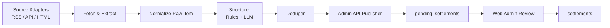

# ClaimPal Scraper Service Design

Date: 2026-05-30
Status: Proposed for implementation planning

Implementation note (2026-05-30): the first implementation now exists in `scraper/` and uses `beautifulsoup4` for HTML extraction, SQLite for initial state storage/deduplication, and `CourtListener` RSS as the first concrete source adapter.

## Purpose

设计并规范 ClaimPal 的抓取器（Scraper Service）实现方案，使其能够从多个 class action settlement 数据源稳定获取候选案件，将原始内容与结构化字段推送到现有 `admin_panel/` 审核流中，并保持与 `pending_settlements`、`settlements`、`global_meta.data_version` 的职责边界清晰。

该设计文档关注抓取与入池链路，不替代现有 Web Admin 审核后台设计，也不改变 Flutter 客户端同步协议。

## Background

当前仓库已经具备以下能力：

- `admin_panel/`：独立 FastAPI 审核后台。
- `POST /api/admin/scraped-pool`：供抓取器写入待审核记录。
- `public.pending_settlements`：待人工审核的临时队列表。
- `POST /api/admin/approve/{id}`：人工审核通过后发布到 `public.settlements`。
- `public.global_meta.data_version`：与线上 `settlements.version_id` 保持同步，用于客户端增量更新。

当前仓库**未实现完整抓取器**。因此需要新增一个独立的抓取服务，以便将外部来源数据稳定导入现有审核体系。

## Goals

本设计的目标：

- 从多个外部来源发现新的 settlement 候选项。
- 提取适合人工审核的原始内容，保留来源链接与抓取上下文。
- 将原始内容通过规则与 LLM 清洗为结构化字段。
- 对重复内容进行过滤，避免同一案件反复进入审核池。
- 通过 `admin_panel` 的受保护 API 将结果写入 `pending_settlements`。
- 记录足够的调试与审计信息，以便后续排查抓取错误、模型错误与重复入池问题。

## Non-Goals

本设计第一阶段不包含：

- 直接将抓取结果写入 `public.settlements`。
- 替代人工审核流程。
- 多管理员协作工作流。
- 浏览器截图存储、页面归档系统、对象存储快照系统。
- 大规模分布式调度平台（如 Kafka / Celery 集群）。
- 对 Flutter 客户端同步机制做任何 schema 变更。

## High-Level Architecture

推荐将抓取器实现为仓库中的独立 Python 子项目，例如：`scraper/`。



该服务与现有系统的关系如下：

- `scraper/` 负责发现、提取、结构化、去重、推送。
- `admin_panel/` 负责鉴权、待审核存储、人工编辑、批准、拒绝。
- `supabase/` 负责表结构、迁移、版本一致性。
- Flutter 客户端仅消费审核发布后的线上数据。

## Repository Placement

推荐新增如下目录结构：

```text
scraper/
  README.md
  requirements.txt
  .env
  app/
    main.py
    settings.py
    models/
      raw_item.py
      normalized_item.py
      pending_payload.py
    sources/
      base.py
      top_class_actions.py
      classaction_org.py
      canlii.py
      courtlistener.py
    extractors/
      html_to_text.py
      settlement_facts.py
    clients/
      admin_api.py
      llm_client.py
    services/
      dedupe.py
      structurer.py
      publisher.py
      state_store.py
    pipelines/
      ingest.py
    utils/
      hashing.py
      dates.py
      money.py
      logging.py
  tests/
```

## Source Strategy

### Recommended Sources

根据现有 PRD，首批数据源包括：

- Top Class Actions
- ClassAction.org
- CanLII
- CourtListener RSS / API

当前首个落地来源为 `CourtListener` RSS；HTML 来源保留了适配器位置与 stub，便于后续继续接入 `Top Class Actions` 等页面型来源。

### Source Types

建议按接入方式分为三类：

1. **RSS / Feed 型**
   - 适合增量发现新内容。
   - 解析成本低。
   - 例如 CourtListener RSS。

2. **API 型**
   - 结构化程度高。
   - 抗页面改版能力强。
   - 优先级应高于 HTML 抓取。

3. **HTML 页面型**
   - 常用于营销内容或案件详情页。
   - 易受站点改版影响。
   - 需要更强的提取、回退和监控策略。

### Adapter Contract

每个来源适配器应实现统一接口：

- `fetch_candidates()`：获取候选条目列表。
- `fetch_detail(candidate)`：获取候选条目详情页原文或结构化结果。
- `source_name`：返回来源名称，用于日志与 `scraper_payload`。

候选条目至少应包含：

- 来源名
- 标题
- 详情页 URL
- 发布时间（若可得）
- 列表页 URL 或 feed URL

## Data Flow Details

### Step 1: Discover Candidates

抓取器从各来源拉取最近的候选内容，并形成统一的原始候选对象。

候选对象建议包含：

- `source`
- `source_url`
- `title`
- `published_at`
- `discovered_at`
- `metadata`

### Step 2: Fetch And Extract Raw Content

对于每个候选条目，抓取详情页正文或 feed 摘要，提取可供审核员阅读的原始内容。

建议保留两类内容：

- 可读版本：用于 `raw_content`
- 调试版本：保存在 `scraper_payload`

推荐优先输出：

- `raw_content_type = "markdown"`：如果提取器能保留合理结构。
- `raw_content_type = "text"`：作为默认回退。
- `raw_content_type = "html"`：仅在确实需要保留 HTML 片段时使用。

### Step 3: Normalize

在结构化前对来源内容做统一归一化，得到 `NormalizedItem`。建议字段：

- `source`
- `source_url`
- `title`
- `raw_content`
- `raw_content_type`
- `published_at`
- `scraped_at`
- `country_hint`
- `fingerprint`
- `metadata`

### Step 4: Structure With Rules And LLM

建议使用“两层清洗”策略：

1. **规则抽取优先**
   - 适合提取日期、金额、国家、布尔字段候选。
   - 成本更低，行为更稳定。

2. **LLM 结构化补全**
   - 适合归纳 `brand_name`、`eligibility_text`、复杂的 `proof_required` 判断。
   - 适合在多候选日期、多金额片段出现时进行语义消歧。

LLM 输出后必须再经过本地校验，确保符合 `admin_panel` 的入参约束。

## Target Contract With Admin API

抓取器必须通过现有后台接口写入待审核池：

- `POST /api/admin/scraped-pool`

不得绕过后台直接写 `public.pending_settlements`，原因如下：

- 统一鉴权入口。
- 统一输入校验逻辑。
- 降低数据库凭据暴露风险。
- 保持与现有后台测试、路由和数据模型一致。

### Payload Shape

目标 payload 应符合 `PendingSettlementCreate`：

- `source_url`
- `raw_content`
- `raw_content_type`
- `brand_name`
- `max_payout`
- `country`
- `proof_required`
- `deadline`
- `eligibility_text`
- `ai_payload`
- `scraper_payload`

### Field Rules

- `raw_content`：必填，且不能为空字符串。
- `brand_name`：必填，且不能为空字符串。
- `country`：只能为 `US` 或 `CA`。
- `max_payout`：若存在，必须为非负数。
- `deadline`：若存在，必须可解析为日期。
- `raw_content_type`：仅允许 `text`、`html`、`markdown`。

### Example Payload

```json
{
  "source_url": "https://example.com/apple-settlement",
  "raw_content": "Apple settlement details...",
  "raw_content_type": "markdown",
  "brand_name": "Apple",
  "max_payout": "35.00",
  "country": "US",
  "proof_required": false,
  "deadline": "2026-08-14",
  "eligibility_text": "US customers with qualifying purchases.",
  "ai_payload": {
    "model": "gpt",
    "confidence": 0.92,
    "prompt_version": "scraper-v1",
    "warnings": []
  },
  "scraper_payload": {
    "source": "topclassactions",
    "adapter_version": "v1",
    "fetched_at": "2026-05-30T20:00:00Z",
    "content_hash": "sha256:abc123"
  }
}
```

## Deduplication Strategy

当前 `pending_settlements` 表没有为抓取器提供强去重约束，因此推荐在抓取器侧实现三层去重：

### Layer 1: URL Deduplication

按 `source_url` 去重，适合同一详情页 URL 稳定的来源。

### Layer 2: Content Hash Deduplication

对以下内容计算规范化 hash：

- 来源名
- 标题
- 规范化正文

生成 `content_hash` 后，可识别带 tracking 参数变化或镜像链接导致的重复内容。

### Layer 3: Business Similarity Heuristics

对以下字段构造近似业务指纹：

- `brand_name`
- `deadline`
- `country`
- `max_payout`

该层用于发现“不同来源重复报道同一 settlement”的情况。第一阶段可先只做日志告警，不强制拦截。

### State Store

推荐为抓取器维护一份独立状态存储，可先用 SQLite 或独立 Postgres 表。建议记录：

- `source_url`
- `content_hash`
- `status`
- `first_seen_at`
- `last_seen_at`
- `published_to_pending_at`
- `admin_pending_id`
- `error_message`

## Internal Data Models

建议在抓取器内部定义三层数据模型：

### RawItem

来源适配器的直接输出：

- `source`
- `source_url`
- `title`
- `published_at`
- `raw_html`
- `raw_text`
- `metadata`

### NormalizedItem

提取与归一化后的对象：

- `source`
- `source_url`
- `title`
- `raw_content`
- `raw_content_type`
- `published_at`
- `scraped_at`
- `country_hint`
- `fingerprint`
- `metadata`

### PendingPayload

即将推送到后台的最终对象：

- `source_url`
- `raw_content`
- `raw_content_type`
- `brand_name`
- `max_payout`
- `country`
- `proof_required`
- `deadline`
- `eligibility_text`
- `ai_payload`
- `scraper_payload`

## `ai_payload` Design

`ai_payload` 用于保留模型结构化输出的上下文和可解释性信息。建议字段：

- `model`
- `confidence`
- `prompt_version`
- `parsed_fields`
- `warnings`
- `evidence`

其中 `evidence` 可包含：

- 支撑 `deadline` 的原文片段
- 支撑 `max_payout` 的原文片段
- 支撑 `proof_required` 的判断依据

这样审核员或开发者可以快速定位模型为何做出某个判断。

## `scraper_payload` Design

`scraper_payload` 用于保留抓取侧上下文与调试信息。建议字段：

- `source`
- `adapter_version`
- `selector_version`
- `fetched_at`
- `list_url`
- `http_status`
- `content_hash`
- `title`
- `published_at`
- `raw_excerpt`

该字段用于：

- 分析站点改版导致的解析失败。
- 回溯重复入池的根因。
- 追踪某条记录由哪个来源、哪版适配器推送。

## Execution Model

### Phase 1: MVP CLI

第一阶段建议提供单次执行入口，例如：

- 运行单个来源
- 运行全部来源
- dry-run 仅输出 payload，不推送

这有利于本地联调与快速验证，不必一开始就引入复杂调度系统。

### Phase 2: Scheduled Runs

第二阶段再增加定时执行，可选方式包括：

- Windows Task Scheduler
- cron
- GitHub Actions
- APScheduler

建议频率：

- RSS / API 来源：每 1 到 3 小时
- HTML 来源：每天 2 到 4 次

## Error Handling

抓取器应采用“单条失败不影响整轮任务”的容错策略。

### Network Errors

- 设置统一超时。
- 对 `429`、`5xx` 采用有限次重试和指数退避。
- 记录来源级失败计数。

### Parse Errors

- 保留来源 URL、标题、正文摘要。
- 标记 `parse_failed`。
- 不让单条解析失败中断整批任务。

### LLM Errors

- 模型超时或返回不合规 JSON 时回退到规则模式。
- 若核心字段不足，可选择不推送，并记录原因。

### Admin API Errors

- `401`：说明 `ADMIN_BEARER_TOKEN` 配置错误，应立即告警并停止推送。
- `422`：说明 payload 不符合后台 schema，应记录完整校验错误与字段上下文。
- `5xx`：说明后台暂时异常，可有限次重试。

## Security Model

抓取器应遵循以下安全原则：

- `ADMIN_BEARER_TOKEN` 仅保存在抓取器运行环境中，不写入日志。
- 不将数据库连接串嵌入抓取器，抓取器只调用后台 API。
- 不在前端、公开日志或错误消息中暴露敏感凭据。
- 使用明确的 `User-Agent`，尊重来源网站的 robots 与服务条款。
- 控制请求速率，避免对来源站点造成过高压力。

## Operational Observability

建议记录两类日志：

### Job-Level Metrics

- 来源名
- 候选数
- 去重跳过数
- 成功推送数
- 失败数
- 总耗时

### Item-Level Events

- `candidate_discovered`
- `detail_fetched`
- `structured_success`
- `structured_failed`
- `publish_success`
- `publish_failed`

每条日志建议至少包含：

- `source`
- `source_url`
- `content_hash`
- `status`
- `error_message`

推荐使用结构化 JSON 日志，便于后续过滤与告警。

## Testing Strategy

### Unit Tests

重点覆盖：

- HTML 提取逻辑
- 日期解析
- 金额解析
- schema 校验
- 去重逻辑

### Integration Tests

重点覆盖：

- 来源适配器生成候选项
- 结构化结果是否符合 `PendingSettlementCreate`
- 与 `POST /api/admin/scraped-pool` 的交互
- `401` / `422` / `5xx` 错误处理

### Regression Fixtures

建议为每个来源保存若干固定样本：

- 原始 HTML 或 feed 内容
- 预期提取文本
- 预期结构化结果

这样站点改版时可快速发现回归问题。

## Rollout Plan

### Milestone 1: Single-Source End-To-End

- 接入一个稳定来源（优先 RSS / API）。
- 打通抓取、提取、结构化、推送全链路。
- 在 `admin_panel` 中成功看到待审核记录。

### Milestone 2: Deduplication And Stability

- 增加 URL 去重与内容 hash 去重。
- 完成基础日志与错误处理。
- 验证重复执行不会重复入池。

### Milestone 3: Multi-Source Support

- 接入 2 到 4 个来源。
- 为每个来源补充回归样本与适配器测试。

### Milestone 4: Higher-Quality Structuring

- 增强 LLM 结构化提示词与证据输出。
- 提高 `eligibility_text` 与 `proof_required` 的可解释性。

## Recommended Environment Variables

建议抓取器使用独立 `.env` 配置，例如：

```env
ADMIN_API_BASE_URL=http://127.0.0.1:8008
ADMIN_BEARER_TOKEN=replace-with-admin-token
LLM_API_KEY=replace-with-llm-key
SCRAPER_STATE_DB_URL=sqlite:///scraper_state.db
REQUEST_TIMEOUT_SECONDS=20
MAX_RETRIES=3
```

## Design Invariants

以下不变量必须在实现中始终保持：

1. 抓取器只写入待审核池，不直接写线上 `settlements`。
2. `global_meta.data_version` 只应由审核发布流程推进，不应由抓取器推进。
3. 所有对后台的写入都经由 `POST /api/admin/scraped-pool`。
4. 每条抓取结果都应保留足够的来源信息与调试信息，以便人工审核与问题定位。
5. 去重策略必须在抓取器侧落地，避免重复污染人工审核队列。

## Open Questions

在开始实现前，建议确认以下问题：

1. 首批优先接入哪一个来源，是否优先选择 CourtListener RSS / API？
2. LLM 供应商与预算限制是什么？是否允许在第一阶段仅使用规则抽取？
3. 抓取器状态存储是否允许先使用 SQLite，后续再迁移到 Postgres？
4. 是否需要为高价值来源保留原始 HTML 快照，以支持后续审计？
5. 是否需要对不同来源设置不同的优先级、频率和告警阈值？

## Summary

本设计建议新增一个独立 `scraper/` 子项目，采用 Python 实现多来源抓取、正文提取、规则与 LLM 结构化、去重与后台入池推送。该方案与现有 `admin_panel/`、`pending_settlements`、`settlements`、`global_meta.data_version` 形成清晰的职责边界，并保持 ClaimPal 当前的 Human-in-the-loop 审核模式不变。
